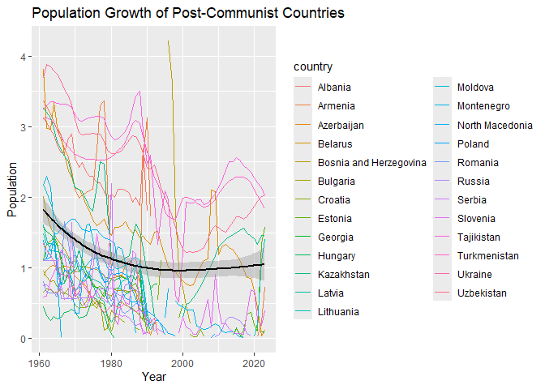

EDA for GDP-Per Capita and Population Growth
================

``` r
library(tidyverse)
```

    ## ── Attaching core tidyverse packages ──────────────────────── tidyverse 2.0.0 ──
    ## ✔ dplyr     1.1.4     ✔ readr     2.1.5
    ## ✔ forcats   1.0.0     ✔ stringr   1.5.1
    ## ✔ ggplot2   3.5.1     ✔ tibble    3.2.1
    ## ✔ lubridate 1.9.4     ✔ tidyr     1.3.1
    ## ✔ purrr     1.0.2     
    ## ── Conflicts ────────────────────────────────────────── tidyverse_conflicts() ──
    ## ✖ dplyr::filter() masks stats::filter()
    ## ✖ dplyr::lag()    masks stats::lag()
    ## ℹ Use the conflicted package (<http://conflicted.r-lib.org/>) to force all conflicts to become errors

``` r
library(dplyr)
```

Import data files

``` r
# import child mortality csv
df_child_mortality <- read_csv("./data_files/child_mortality_0_5_year_olds_dying_per_1000_born.csv")
```

    ## Rows: 197 Columns: 302
    ## ── Column specification ────────────────────────────────────────────────────────
    ## Delimiter: ","
    ## chr   (1): country
    ## dbl (301): 1800, 1801, 1802, 1803, 1804, 1805, 1806, 1807, 1808, 1809, 1810,...
    ## 
    ## ℹ Use `spec()` to retrieve the full column specification for this data.
    ## ℹ Specify the column types or set `show_col_types = FALSE` to quiet this message.

``` r
# " daily income csv
df_daily_income <- read_csv("./data_files/mincpcap_cppp.csv")
```

    ## Rows: 195 Columns: 302
    ## ── Column specification ────────────────────────────────────────────────────────
    ## Delimiter: ","
    ## chr   (1): country
    ## dbl (301): 1800, 1801, 1802, 1803, 1804, 1805, 1806, 1807, 1808, 1809, 1810,...
    ## 
    ## ℹ Use `spec()` to retrieve the full column specification for this data.
    ## ℹ Specify the column types or set `show_col_types = FALSE` to quiet this message.

``` r
# " life expectancy at birth csv
df_life_expectancy <- read_csv("./data_files/life_exp.csv")
```

    ## Rows: 196 Columns: 302
    ## ── Column specification ────────────────────────────────────────────────────────
    ## Delimiter: ","
    ## chr   (1): country
    ## dbl (301): 1800, 1801, 1802, 1803, 1804, 1805, 1806, 1807, 1808, 1809, 1810,...
    ## 
    ## ℹ Use `spec()` to retrieve the full column specification for this data.
    ## ℹ Specify the column types or set `show_col_types = FALSE` to quiet this message.

``` r
# " population growth csv
df_pop_growth <- read_csv("./data_files/population_growth_annual_percent.csv")
```

    ## Rows: 217 Columns: 64
    ## ── Column specification ────────────────────────────────────────────────────────
    ## Delimiter: ","
    ## chr (64): country, 1961, 1962, 1963, 1964, 1965, 1966, 1967, 1968, 1969, 197...
    ## 
    ## ℹ Use `spec()` to retrieve the full column specification for this data.
    ## ℹ Specify the column types or set `show_col_types = FALSE` to quiet this message.

``` r
# " fertility csv
df_fertility <- read_csv("./data_files/children_per_woman_total_fertility.csv")
```

    ## Rows: 197 Columns: 302
    ## ── Column specification ────────────────────────────────────────────────────────
    ## Delimiter: ","
    ## chr   (1): country
    ## dbl (301): 1800, 1801, 1802, 1803, 1804, 1805, 1806, 1807, 1808, 1809, 1810,...
    ## 
    ## ℹ Use `spec()` to retrieve the full column specification for this data.
    ## ℹ Specify the column types or set `show_col_types = FALSE` to quiet this message.

``` r
# " c02 emissions csv
df_co2emissions <- read_csv("./data_files/co2_pcap_cons.csv")
```

    ## Rows: 194 Columns: 224
    ## ── Column specification ────────────────────────────────────────────────────────
    ## Delimiter: ","
    ## chr   (8): country, 2003, 2004, 2005, 2006, 2011, 2012, 2013
    ## dbl (216): 1800, 1801, 1802, 1803, 1804, 1805, 1806, 1807, 1808, 1809, 1810,...
    ## 
    ## ℹ Use `spec()` to retrieve the full column specification for this data.
    ## ℹ Specify the column types or set `show_col_types = FALSE` to quiet this message.

``` r
# " population csv
df_population <- read_csv("./data_files/pop.csv")
```

    ## Rows: 197 Columns: 302
    ## ── Column specification ────────────────────────────────────────────────────────
    ## Delimiter: ","
    ## chr (302): country, 1800, 1801, 1802, 1803, 1804, 1805, 1806, 1807, 1808, 18...
    ## 
    ## ℹ Use `spec()` to retrieve the full column specification for this data.
    ## ℹ Specify the column types or set `show_col_types = FALSE` to quiet this message.

``` r
# " GDP-per-capital csv
df_gdp_percap <- read_csv("./data_files/gdp_pcap.csv")
```

    ## Rows: 195 Columns: 302
    ## ── Column specification ────────────────────────────────────────────────────────
    ## Delimiter: ","
    ## chr (199): country, 1901, 1903, 1905, 1906, 1907, 1908, 1909, 1910, 1911, 19...
    ## dbl (103): 1800, 1801, 1802, 1803, 1804, 1805, 1806, 1807, 1808, 1809, 1810,...
    ## 
    ## ℹ Use `spec()` to retrieve the full column specification for this data.
    ## ℹ Specify the column types or set `show_col_types = FALSE` to quiet this message.


    Factors we want to examine for quality of life: 

    - child mortality
    - daily income
    - GDP-per-capita
    - life expectancy at birth 
    - population growth
    - fertility
    - c02 emissions
    - population 

    Make EDA plots here!:

``` r
# df_pop graphs for soviet bloc countries 


# if you need to filter for only post-communist countries, use the list below:
# ("Armenia", "Azerbaijan", "Belarus", "Estonia", "Georgia", "Kazakhstan", "Kyrgyzstan", "Latvia", "Lithuania", "Moldova", "Russia", "Tajikistan", "Turkmenistan", "Ukraine", "Uzbekistan", "Serbia", "Croatia", "Bosnia and Herzegovina", "Slovenia", "Montenegro", "North Macedonia", "Albania", "Bulgaria", "Romania", "Poland", "Germany", "Czechia", "Slovakia", "Hungary")
df_pop_g <- df_pop_growth %>% 
  pivot_longer(
    cols = -country,
    names_to = "year",
    values_to = "population"
  ) %>%
  mutate(
    population_numeric = case_when(
      str_detect(population, "k") ~ as.numeric(str_replace(population, "k", "")) * 1e3,
      str_detect(population, "M") ~ as.numeric(str_replace(population, "M", "")) * 1e6,
      str_detect(population, "B") ~ as.numeric(str_replace(population, "B", "")) * 1e9,
      TRUE ~ as.numeric(population)
    )
  ) %>% 
  filter(as.numeric(year) <= 2025)
```

    ## Warning: There were 4 warnings in `mutate()`.
    ## The first warning was:
    ## ℹ In argument: `population_numeric = case_when(...)`.
    ## Caused by warning:
    ## ! NAs introduced by coercion
    ## ℹ Run `dplyr::last_dplyr_warnings()` to see the 3 remaining warnings.

``` r
df_growth <- df_pop_g %>% 
  filter(country %in% c("Armenia", "Azerbaijan", "Belarus", "Estonia", "Georgia", "Kazakhstan", "Kyrgyzstan", "Latvia", "Lithuania", "Moldova", "Russia", "Tajikistan", "Turkmenistan", "Ukraine", "Uzbekistan", "Serbia", "Croatia", "Bosnia and Herzegovina", "Slovenia", "Montenegro", "North Macedonia", "Albania", "Bulgaria", "Romania", "Poland", "Czechia", "Slovakia", "Hungary")) 

df_growth %>% 
  ggplot(aes(x = as.numeric(year), y = population_numeric)) +
  geom_line(aes(color = country)) +
  geom_smooth(method = "loess", color = "black", se = TRUE) +
  labs(
    title = "Population Growth of Post-Communist Countries",
    x = "Year",
    y = "Population"
  )
```

    ## `geom_smooth()` using formula = 'y ~ x'

    ## Warning: Removed 546 rows containing non-finite outside the scale range
    ## (`stat_smooth()`).

    ## Warning: Removed 298 rows containing missing values or values outside the scale range
    ## (`geom_line()`).

<!-- -->

``` r
df_gdp <- df_gdp_percap %>%
  pivot_longer(
    cols = -country,
    names_to = "year",
    values_to = "gdp",
    values_transform = list(gdp = as.numeric)  # Ensure all values are numeric
  ) %>%
  mutate(year = as.numeric(year))
```

    ## Warning in .Primitive("as.double")(x, ...): NAs introduced by coercion
    ## Warning in .Primitive("as.double")(x, ...): NAs introduced by coercion
    ## Warning in .Primitive("as.double")(x, ...): NAs introduced by coercion
    ## Warning in .Primitive("as.double")(x, ...): NAs introduced by coercion
    ## Warning in .Primitive("as.double")(x, ...): NAs introduced by coercion
    ## Warning in .Primitive("as.double")(x, ...): NAs introduced by coercion
    ## Warning in .Primitive("as.double")(x, ...): NAs introduced by coercion
    ## Warning in .Primitive("as.double")(x, ...): NAs introduced by coercion
    ## Warning in .Primitive("as.double")(x, ...): NAs introduced by coercion
    ## Warning in .Primitive("as.double")(x, ...): NAs introduced by coercion
    ## Warning in .Primitive("as.double")(x, ...): NAs introduced by coercion
    ## Warning in .Primitive("as.double")(x, ...): NAs introduced by coercion
    ## Warning in .Primitive("as.double")(x, ...): NAs introduced by coercion
    ## Warning in .Primitive("as.double")(x, ...): NAs introduced by coercion
    ## Warning in .Primitive("as.double")(x, ...): NAs introduced by coercion
    ## Warning in .Primitive("as.double")(x, ...): NAs introduced by coercion
    ## Warning in .Primitive("as.double")(x, ...): NAs introduced by coercion
    ## Warning in .Primitive("as.double")(x, ...): NAs introduced by coercion
    ## Warning in .Primitive("as.double")(x, ...): NAs introduced by coercion
    ## Warning in .Primitive("as.double")(x, ...): NAs introduced by coercion
    ## Warning in .Primitive("as.double")(x, ...): NAs introduced by coercion
    ## Warning in .Primitive("as.double")(x, ...): NAs introduced by coercion
    ## Warning in .Primitive("as.double")(x, ...): NAs introduced by coercion
    ## Warning in .Primitive("as.double")(x, ...): NAs introduced by coercion
    ## Warning in .Primitive("as.double")(x, ...): NAs introduced by coercion
    ## Warning in .Primitive("as.double")(x, ...): NAs introduced by coercion
    ## Warning in .Primitive("as.double")(x, ...): NAs introduced by coercion
    ## Warning in .Primitive("as.double")(x, ...): NAs introduced by coercion
    ## Warning in .Primitive("as.double")(x, ...): NAs introduced by coercion
    ## Warning in .Primitive("as.double")(x, ...): NAs introduced by coercion
    ## Warning in .Primitive("as.double")(x, ...): NAs introduced by coercion
    ## Warning in .Primitive("as.double")(x, ...): NAs introduced by coercion
    ## Warning in .Primitive("as.double")(x, ...): NAs introduced by coercion
    ## Warning in .Primitive("as.double")(x, ...): NAs introduced by coercion
    ## Warning in .Primitive("as.double")(x, ...): NAs introduced by coercion
    ## Warning in .Primitive("as.double")(x, ...): NAs introduced by coercion
    ## Warning in .Primitive("as.double")(x, ...): NAs introduced by coercion
    ## Warning in .Primitive("as.double")(x, ...): NAs introduced by coercion
    ## Warning in .Primitive("as.double")(x, ...): NAs introduced by coercion
    ## Warning in .Primitive("as.double")(x, ...): NAs introduced by coercion
    ## Warning in .Primitive("as.double")(x, ...): NAs introduced by coercion
    ## Warning in .Primitive("as.double")(x, ...): NAs introduced by coercion
    ## Warning in .Primitive("as.double")(x, ...): NAs introduced by coercion
    ## Warning in .Primitive("as.double")(x, ...): NAs introduced by coercion
    ## Warning in .Primitive("as.double")(x, ...): NAs introduced by coercion
    ## Warning in .Primitive("as.double")(x, ...): NAs introduced by coercion
    ## Warning in .Primitive("as.double")(x, ...): NAs introduced by coercion
    ## Warning in .Primitive("as.double")(x, ...): NAs introduced by coercion
    ## Warning in .Primitive("as.double")(x, ...): NAs introduced by coercion
    ## Warning in .Primitive("as.double")(x, ...): NAs introduced by coercion
    ## Warning in .Primitive("as.double")(x, ...): NAs introduced by coercion
    ## Warning in .Primitive("as.double")(x, ...): NAs introduced by coercion
    ## Warning in .Primitive("as.double")(x, ...): NAs introduced by coercion
    ## Warning in .Primitive("as.double")(x, ...): NAs introduced by coercion
    ## Warning in .Primitive("as.double")(x, ...): NAs introduced by coercion
    ## Warning in .Primitive("as.double")(x, ...): NAs introduced by coercion
    ## Warning in .Primitive("as.double")(x, ...): NAs introduced by coercion
    ## Warning in .Primitive("as.double")(x, ...): NAs introduced by coercion
    ## Warning in .Primitive("as.double")(x, ...): NAs introduced by coercion
    ## Warning in .Primitive("as.double")(x, ...): NAs introduced by coercion
    ## Warning in .Primitive("as.double")(x, ...): NAs introduced by coercion
    ## Warning in .Primitive("as.double")(x, ...): NAs introduced by coercion
    ## Warning in .Primitive("as.double")(x, ...): NAs introduced by coercion
    ## Warning in .Primitive("as.double")(x, ...): NAs introduced by coercion
    ## Warning in .Primitive("as.double")(x, ...): NAs introduced by coercion
    ## Warning in .Primitive("as.double")(x, ...): NAs introduced by coercion
    ## Warning in .Primitive("as.double")(x, ...): NAs introduced by coercion
    ## Warning in .Primitive("as.double")(x, ...): NAs introduced by coercion
    ## Warning in .Primitive("as.double")(x, ...): NAs introduced by coercion
    ## Warning in .Primitive("as.double")(x, ...): NAs introduced by coercion
    ## Warning in .Primitive("as.double")(x, ...): NAs introduced by coercion
    ## Warning in .Primitive("as.double")(x, ...): NAs introduced by coercion
    ## Warning in .Primitive("as.double")(x, ...): NAs introduced by coercion
    ## Warning in .Primitive("as.double")(x, ...): NAs introduced by coercion
    ## Warning in .Primitive("as.double")(x, ...): NAs introduced by coercion
    ## Warning in .Primitive("as.double")(x, ...): NAs introduced by coercion
    ## Warning in .Primitive("as.double")(x, ...): NAs introduced by coercion
    ## Warning in .Primitive("as.double")(x, ...): NAs introduced by coercion
    ## Warning in .Primitive("as.double")(x, ...): NAs introduced by coercion
    ## Warning in .Primitive("as.double")(x, ...): NAs introduced by coercion
    ## Warning in .Primitive("as.double")(x, ...): NAs introduced by coercion
    ## Warning in .Primitive("as.double")(x, ...): NAs introduced by coercion
    ## Warning in .Primitive("as.double")(x, ...): NAs introduced by coercion
    ## Warning in .Primitive("as.double")(x, ...): NAs introduced by coercion
    ## Warning in .Primitive("as.double")(x, ...): NAs introduced by coercion
    ## Warning in .Primitive("as.double")(x, ...): NAs introduced by coercion
    ## Warning in .Primitive("as.double")(x, ...): NAs introduced by coercion
    ## Warning in .Primitive("as.double")(x, ...): NAs introduced by coercion
    ## Warning in .Primitive("as.double")(x, ...): NAs introduced by coercion
    ## Warning in .Primitive("as.double")(x, ...): NAs introduced by coercion
    ## Warning in .Primitive("as.double")(x, ...): NAs introduced by coercion
    ## Warning in .Primitive("as.double")(x, ...): NAs introduced by coercion
    ## Warning in .Primitive("as.double")(x, ...): NAs introduced by coercion
    ## Warning in .Primitive("as.double")(x, ...): NAs introduced by coercion
    ## Warning in .Primitive("as.double")(x, ...): NAs introduced by coercion
    ## Warning in .Primitive("as.double")(x, ...): NAs introduced by coercion
    ## Warning in .Primitive("as.double")(x, ...): NAs introduced by coercion
    ## Warning in .Primitive("as.double")(x, ...): NAs introduced by coercion
    ## Warning in .Primitive("as.double")(x, ...): NAs introduced by coercion
    ## Warning in .Primitive("as.double")(x, ...): NAs introduced by coercion
    ## Warning in .Primitive("as.double")(x, ...): NAs introduced by coercion
    ## Warning in .Primitive("as.double")(x, ...): NAs introduced by coercion
    ## Warning in .Primitive("as.double")(x, ...): NAs introduced by coercion
    ## Warning in .Primitive("as.double")(x, ...): NAs introduced by coercion
    ## Warning in .Primitive("as.double")(x, ...): NAs introduced by coercion
    ## Warning in .Primitive("as.double")(x, ...): NAs introduced by coercion
    ## Warning in .Primitive("as.double")(x, ...): NAs introduced by coercion
    ## Warning in .Primitive("as.double")(x, ...): NAs introduced by coercion
    ## Warning in .Primitive("as.double")(x, ...): NAs introduced by coercion
    ## Warning in .Primitive("as.double")(x, ...): NAs introduced by coercion
    ## Warning in .Primitive("as.double")(x, ...): NAs introduced by coercion
    ## Warning in .Primitive("as.double")(x, ...): NAs introduced by coercion
    ## Warning in .Primitive("as.double")(x, ...): NAs introduced by coercion
    ## Warning in .Primitive("as.double")(x, ...): NAs introduced by coercion
    ## Warning in .Primitive("as.double")(x, ...): NAs introduced by coercion
    ## Warning in .Primitive("as.double")(x, ...): NAs introduced by coercion
    ## Warning in .Primitive("as.double")(x, ...): NAs introduced by coercion
    ## Warning in .Primitive("as.double")(x, ...): NAs introduced by coercion
    ## Warning in .Primitive("as.double")(x, ...): NAs introduced by coercion
    ## Warning in .Primitive("as.double")(x, ...): NAs introduced by coercion
    ## Warning in .Primitive("as.double")(x, ...): NAs introduced by coercion
    ## Warning in .Primitive("as.double")(x, ...): NAs introduced by coercion
    ## Warning in .Primitive("as.double")(x, ...): NAs introduced by coercion
    ## Warning in .Primitive("as.double")(x, ...): NAs introduced by coercion
    ## Warning in .Primitive("as.double")(x, ...): NAs introduced by coercion
    ## Warning in .Primitive("as.double")(x, ...): NAs introduced by coercion
    ## Warning in .Primitive("as.double")(x, ...): NAs introduced by coercion
    ## Warning in .Primitive("as.double")(x, ...): NAs introduced by coercion
    ## Warning in .Primitive("as.double")(x, ...): NAs introduced by coercion
    ## Warning in .Primitive("as.double")(x, ...): NAs introduced by coercion
    ## Warning in .Primitive("as.double")(x, ...): NAs introduced by coercion
    ## Warning in .Primitive("as.double")(x, ...): NAs introduced by coercion
    ## Warning in .Primitive("as.double")(x, ...): NAs introduced by coercion
    ## Warning in .Primitive("as.double")(x, ...): NAs introduced by coercion
    ## Warning in .Primitive("as.double")(x, ...): NAs introduced by coercion
    ## Warning in .Primitive("as.double")(x, ...): NAs introduced by coercion
    ## Warning in .Primitive("as.double")(x, ...): NAs introduced by coercion
    ## Warning in .Primitive("as.double")(x, ...): NAs introduced by coercion
    ## Warning in .Primitive("as.double")(x, ...): NAs introduced by coercion
    ## Warning in .Primitive("as.double")(x, ...): NAs introduced by coercion
    ## Warning in .Primitive("as.double")(x, ...): NAs introduced by coercion
    ## Warning in .Primitive("as.double")(x, ...): NAs introduced by coercion
    ## Warning in .Primitive("as.double")(x, ...): NAs introduced by coercion
    ## Warning in .Primitive("as.double")(x, ...): NAs introduced by coercion
    ## Warning in .Primitive("as.double")(x, ...): NAs introduced by coercion
    ## Warning in .Primitive("as.double")(x, ...): NAs introduced by coercion
    ## Warning in .Primitive("as.double")(x, ...): NAs introduced by coercion
    ## Warning in .Primitive("as.double")(x, ...): NAs introduced by coercion
    ## Warning in .Primitive("as.double")(x, ...): NAs introduced by coercion
    ## Warning in .Primitive("as.double")(x, ...): NAs introduced by coercion
    ## Warning in .Primitive("as.double")(x, ...): NAs introduced by coercion
    ## Warning in .Primitive("as.double")(x, ...): NAs introduced by coercion
    ## Warning in .Primitive("as.double")(x, ...): NAs introduced by coercion
    ## Warning in .Primitive("as.double")(x, ...): NAs introduced by coercion
    ## Warning in .Primitive("as.double")(x, ...): NAs introduced by coercion
    ## Warning in .Primitive("as.double")(x, ...): NAs introduced by coercion
    ## Warning in .Primitive("as.double")(x, ...): NAs introduced by coercion
    ## Warning in .Primitive("as.double")(x, ...): NAs introduced by coercion
    ## Warning in .Primitive("as.double")(x, ...): NAs introduced by coercion
    ## Warning in .Primitive("as.double")(x, ...): NAs introduced by coercion
    ## Warning in .Primitive("as.double")(x, ...): NAs introduced by coercion
    ## Warning in .Primitive("as.double")(x, ...): NAs introduced by coercion
    ## Warning in .Primitive("as.double")(x, ...): NAs introduced by coercion
    ## Warning in .Primitive("as.double")(x, ...): NAs introduced by coercion
    ## Warning in .Primitive("as.double")(x, ...): NAs introduced by coercion
    ## Warning in .Primitive("as.double")(x, ...): NAs introduced by coercion
    ## Warning in .Primitive("as.double")(x, ...): NAs introduced by coercion
    ## Warning in .Primitive("as.double")(x, ...): NAs introduced by coercion
    ## Warning in .Primitive("as.double")(x, ...): NAs introduced by coercion
    ## Warning in .Primitive("as.double")(x, ...): NAs introduced by coercion
    ## Warning in .Primitive("as.double")(x, ...): NAs introduced by coercion
    ## Warning in .Primitive("as.double")(x, ...): NAs introduced by coercion
    ## Warning in .Primitive("as.double")(x, ...): NAs introduced by coercion
    ## Warning in .Primitive("as.double")(x, ...): NAs introduced by coercion
    ## Warning in .Primitive("as.double")(x, ...): NAs introduced by coercion
    ## Warning in .Primitive("as.double")(x, ...): NAs introduced by coercion
    ## Warning in .Primitive("as.double")(x, ...): NAs introduced by coercion
    ## Warning in .Primitive("as.double")(x, ...): NAs introduced by coercion
    ## Warning in .Primitive("as.double")(x, ...): NAs introduced by coercion
    ## Warning in .Primitive("as.double")(x, ...): NAs introduced by coercion
    ## Warning in .Primitive("as.double")(x, ...): NAs introduced by coercion
    ## Warning in .Primitive("as.double")(x, ...): NAs introduced by coercion
    ## Warning in .Primitive("as.double")(x, ...): NAs introduced by coercion
    ## Warning in .Primitive("as.double")(x, ...): NAs introduced by coercion
    ## Warning in .Primitive("as.double")(x, ...): NAs introduced by coercion
    ## Warning in .Primitive("as.double")(x, ...): NAs introduced by coercion
    ## Warning in .Primitive("as.double")(x, ...): NAs introduced by coercion
    ## Warning in .Primitive("as.double")(x, ...): NAs introduced by coercion
    ## Warning in .Primitive("as.double")(x, ...): NAs introduced by coercion
    ## Warning in .Primitive("as.double")(x, ...): NAs introduced by coercion
    ## Warning in .Primitive("as.double")(x, ...): NAs introduced by coercion
    ## Warning in .Primitive("as.double")(x, ...): NAs introduced by coercion
    ## Warning in .Primitive("as.double")(x, ...): NAs introduced by coercion
    ## Warning in .Primitive("as.double")(x, ...): NAs introduced by coercion
    ## Warning in .Primitive("as.double")(x, ...): NAs introduced by coercion
    ## Warning in .Primitive("as.double")(x, ...): NAs introduced by coercion
    ## Warning in .Primitive("as.double")(x, ...): NAs introduced by coercion
    ## Warning in .Primitive("as.double")(x, ...): NAs introduced by coercion

``` r
df_gdp_comm <- df_gdp %>% 
  filter(country %in% c("Armenia", "Azerbaijan", "Belarus", "Estonia", "Georgia", "Kazakhstan", "Kyrgyzstan", "Latvia", "Lithuania", "Moldova", "Russia", "Tajikistan", "Turkmenistan", "Ukraine", "Uzbekistan", "Serbia", "Croatia", "Bosnia and Herzegovina", "Slovenia", "Montenegro", "North Macedonia", "Albania", "Bulgaria", "Romania", "Poland", "Germany", "Czechia", "Slovakia", "Hungary")) %>%
  filter (year <= 2025)
  
df_gdp_comm %>% 
  ggplot(aes(x = year, y = gdp)) +
  geom_line(aes(color = country)) +  
  geom_smooth(method = "loess", color = "black", se = TRUE) +
  labs(
    title = "GDP Change Post-Communist Countries",
    x = "Year",
    y = "GDP"
  )
```

    ## `geom_smooth()` using formula = 'y ~ x'

    ## Warning: Removed 1021 rows containing non-finite outside the scale range
    ## (`stat_smooth()`).

    ## Warning: Removed 756 rows containing missing values or values outside the scale range
    ## (`geom_line()`).

<!-- -->
