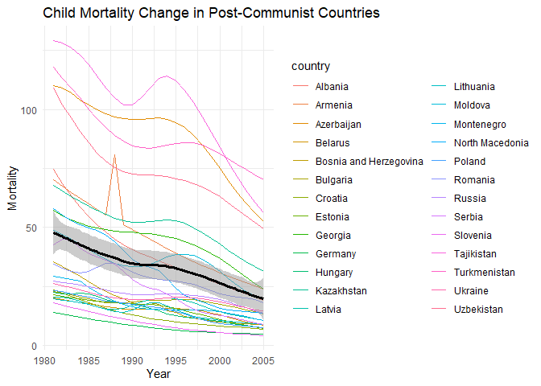

c13-project: Data Science Final Project
================

- [Intro](#intro)
- [Background and Data](#background-and-data)
- [Analysis of Data](#analysis-of-data)
  - [Import data files](#import-data-files)
  - [Metrics](#metrics)
  - [EDA](#eda)
    - [Population Growth](#population-growth)
    - [GDP-Per-Capita](#gdp-per-capita)
    - [Child Mortality](#child-mortality)
    - [Fertility](#fertility)
    - [CO2 Emissions](#co2-emissions)
    - [Population](#population)
    - [Daily Income per Person](#daily-income-per-person)
    - [Life Expectancy](#life-expectancy)
- [Side-by-Side Analysis of Metrics in Our Chosen Timeframe (Punchline
  Graph)](#side-by-side-analysis-of-metrics-in-our-chosen-timeframe-punchline-graph)
- [Conclusion](#conclusion)
- [Quantification of Error](#quantification-of-error)
- [Future Work](#future-work)

``` r
library(tidyverse)
```

    ## ── Attaching core tidyverse packages ──────────────────────── tidyverse 2.0.0 ──
    ## ✔ dplyr     1.1.4     ✔ readr     2.1.5
    ## ✔ forcats   1.0.0     ✔ stringr   1.5.1
    ## ✔ ggplot2   3.5.1     ✔ tibble    3.2.1
    ## ✔ lubridate 1.9.4     ✔ tidyr     1.3.1
    ## ✔ purrr     1.0.2     
    ## ── Conflicts ────────────────────────────────────────── tidyverse_conflicts() ──
    ## ✖ dplyr::filter() masks stats::filter()
    ## ✖ dplyr::lag()    masks stats::lag()
    ## ℹ Use the conflicted package (<http://conflicted.r-lib.org/>) to force all conflicts to become errors

``` r
library(dplyr)
```

# Intro

# Background and Data

As the USSR, Yugoslavia, and other communist countries behind the Iron
Curtain began to decline between the 80’s and 90’s due to a host of
economic and social factors, democracies took their place. Although the
transition from communism to capitalism is seen as a net benefit for
these countries at a high-level, its effect on their population’s
quality of life is not as easy to quantify. To quantify the quality of
life of a nation’s people, we chose the following factors: child
mortality, daily income per person, GDP-per-capita, life expectancy,
population growth, fertility, CO2 emissions, and population. We also
chose these factors as their data was more complete on Gapminder.

# Analysis of Data

To answer our question we chose to source our data from Gapminder, an
independent Swedish foundation that works to dispel common myths around
poverty and inequality in developing nations. To note, some major donors
of Gapminder include the Bill and Melinda Gates Foundation and the Ikea
Foundation, which may or may not introduce some bias into the data they
provide.

### Import data files

``` r
# import child mortality csv
df_child_mortality <- read_csv("./data_files/child_mortality_0_5_year_olds_dying_per_1000_born.csv")
```

    ## Rows: 197 Columns: 302
    ## ── Column specification ────────────────────────────────────────────────────────
    ## Delimiter: ","
    ## chr   (1): country
    ## dbl (301): 1800, 1801, 1802, 1803, 1804, 1805, 1806, 1807, 1808, 1809, 1810,...
    ## 
    ## ℹ Use `spec()` to retrieve the full column specification for this data.
    ## ℹ Specify the column types or set `show_col_types = FALSE` to quiet this message.

``` r
# " daily income csv
df_daily_income <- read_csv("./data_files/mincpcap_cppp.csv")
```

    ## Rows: 195 Columns: 302
    ## ── Column specification ────────────────────────────────────────────────────────
    ## Delimiter: ","
    ## chr   (1): country
    ## dbl (301): 1800, 1801, 1802, 1803, 1804, 1805, 1806, 1807, 1808, 1809, 1810,...
    ## 
    ## ℹ Use `spec()` to retrieve the full column specification for this data.
    ## ℹ Specify the column types or set `show_col_types = FALSE` to quiet this message.

``` r
# " life expectancy at birth csv
df_life_expectancy <- read_csv("./data_files/life_exp.csv")
```

    ## Rows: 196 Columns: 302
    ## ── Column specification ────────────────────────────────────────────────────────
    ## Delimiter: ","
    ## chr   (1): country
    ## dbl (301): 1800, 1801, 1802, 1803, 1804, 1805, 1806, 1807, 1808, 1809, 1810,...
    ## 
    ## ℹ Use `spec()` to retrieve the full column specification for this data.
    ## ℹ Specify the column types or set `show_col_types = FALSE` to quiet this message.

``` r
# " population growth csv
df_pop_growth <- read_csv("./data_files/population_growth_annual_percent.csv")
```

    ## Rows: 217 Columns: 64
    ## ── Column specification ────────────────────────────────────────────────────────
    ## Delimiter: ","
    ## chr (64): country, 1961, 1962, 1963, 1964, 1965, 1966, 1967, 1968, 1969, 197...
    ## 
    ## ℹ Use `spec()` to retrieve the full column specification for this data.
    ## ℹ Specify the column types or set `show_col_types = FALSE` to quiet this message.

``` r
# " fertility csv
df_fertility <- read_csv("./data_files/children_per_woman_total_fertility.csv")
```

    ## Rows: 197 Columns: 302
    ## ── Column specification ────────────────────────────────────────────────────────
    ## Delimiter: ","
    ## chr   (1): country
    ## dbl (301): 1800, 1801, 1802, 1803, 1804, 1805, 1806, 1807, 1808, 1809, 1810,...
    ## 
    ## ℹ Use `spec()` to retrieve the full column specification for this data.
    ## ℹ Specify the column types or set `show_col_types = FALSE` to quiet this message.

``` r
# " c02 emissions csv
df_co2emissions <- read_csv("./data_files/co2_pcap_cons.csv")
```

    ## Rows: 194 Columns: 224
    ## ── Column specification ────────────────────────────────────────────────────────
    ## Delimiter: ","
    ## chr   (8): country, 2003, 2004, 2005, 2006, 2011, 2012, 2013
    ## dbl (216): 1800, 1801, 1802, 1803, 1804, 1805, 1806, 1807, 1808, 1809, 1810,...
    ## 
    ## ℹ Use `spec()` to retrieve the full column specification for this data.
    ## ℹ Specify the column types or set `show_col_types = FALSE` to quiet this message.

``` r
# " population csv
df_population <- read_csv("./data_files/pop.csv")
```

    ## Rows: 197 Columns: 302
    ## ── Column specification ────────────────────────────────────────────────────────
    ## Delimiter: ","
    ## chr (302): country, 1800, 1801, 1802, 1803, 1804, 1805, 1806, 1807, 1808, 18...
    ## 
    ## ℹ Use `spec()` to retrieve the full column specification for this data.
    ## ℹ Specify the column types or set `show_col_types = FALSE` to quiet this message.

``` r
# " GDP-per-capital csv
df_gdp_percap <- read_csv("./data_files/gdp_pcap.csv")
```

    ## Rows: 195 Columns: 302
    ## ── Column specification ────────────────────────────────────────────────────────
    ## Delimiter: ","
    ## chr (199): country, 1901, 1903, 1905, 1906, 1907, 1908, 1909, 1910, 1911, 19...
    ## dbl (103): 1800, 1801, 1802, 1803, 1804, 1805, 1806, 1807, 1808, 1809, 1810,...
    ## 
    ## ℹ Use `spec()` to retrieve the full column specification for this data.
    ## ℹ Specify the column types or set `show_col_types = FALSE` to quiet this message.

## Metrics

As noted above, we use the following metrics to quantify quality of
life:

- child mortality
- daily income
- GDP-per-capita
- life expectancy at birth
- population growth
- fertility
- c02 emissions
- population

## EDA

To begin our analysis of the data, we first perform EDA to get a general
idea for the shape of the overall data. We decided to look at the full
timescale for each of these datasets to determine key inflection points
that could be attributed to the transition from communism to capitalism
that we are interested in. Our full EDA analysis can be found in the
“EDA_c13”, “EDA1”, and “EDA2” files. In this EDA process we decided to
analyze the timeframe from 1980-2005 as that is when most countries that
were communist transitioned to capitalism with the fall of the Soviet
Union and Yugoslavia.

### Population Growth

In this graph for Population Growth post-communism, we can see a
generally steady line that dips slightly downwards in the overall trend.

``` r
df_pop_g <- df_pop_growth %>% 
  pivot_longer(
    cols = -country,
    names_to = "year",
    values_to = "population"
  ) %>%
  mutate(
    population_numeric = case_when(
      str_detect(population, "k") ~ as.numeric(str_replace(population, "k", "")) * 1e3,
      str_detect(population, "M") ~ as.numeric(str_replace(population, "M", "")) * 1e6,
      str_detect(population, "B") ~ as.numeric(str_replace(population, "B", "")) * 1e9,
      TRUE ~ as.numeric(population)
    )
  ) %>% 
  filter(as.numeric(year) <= 2005 & as.numeric(year) > 1980)
```

    ## Warning: There were 4 warnings in `mutate()`.
    ## The first warning was:
    ## ℹ In argument: `population_numeric = case_when(...)`.
    ## Caused by warning:
    ## ! NAs introduced by coercion
    ## ℹ Run `dplyr::last_dplyr_warnings()` to see the 3 remaining warnings.

``` r
df_growth <- df_pop_g %>% 
  filter(country %in% c("Armenia", "Azerbaijan", "Belarus", "Estonia", "Georgia", "Kazakhstan", "Kyrgyzstan", "Latvia", "Lithuania", "Moldova", "Russia", "Tajikistan", "Turkmenistan", "Ukraine", "Uzbekistan", "Serbia", "Croatia", "Bosnia and Herzegovina", "Slovenia", "Montenegro", "North Macedonia", "Albania", "Bulgaria", "Romania", "Poland", "Czechia", "Slovakia", "Hungary")) 

df_growth %>% 
  ggplot(aes(x = as.numeric(year), y = population_numeric)) +
  geom_line(aes(color = country)) +
  geom_smooth(method = "loess", color = "black", se = TRUE) +
  labs(
    title = "Population Growth of Post-Communist Countries",
    x = "Year",
    y = "Population"
  )
```

    ## `geom_smooth()` using formula = 'y ~ x'

    ## Warning: Removed 256 rows containing non-finite outside the scale range
    ## (`stat_smooth()`).

    ## Warning: Removed 196 rows containing missing values or values outside the scale range
    ## (`geom_line()`).

<!-- -->

### GDP-Per-Capita

In this graph for GDP-per-capita post communism, we can see this dip in
the late 1990’s continued by an increase in the 2000’s

``` r
df_gdp <- df_gdp_percap %>%
  pivot_longer(
    cols = -country,
    names_to = "year",
    values_to = "gdp",
    values_transform = list(gdp = as.numeric)  # Ensure all values are numeric
  ) %>%
  mutate(year = as.numeric(year))
```

    ## Warning in .Primitive("as.double")(x, ...): NAs introduced by coercion
    ## Warning in .Primitive("as.double")(x, ...): NAs introduced by coercion
    ## Warning in .Primitive("as.double")(x, ...): NAs introduced by coercion
    ## Warning in .Primitive("as.double")(x, ...): NAs introduced by coercion
    ## Warning in .Primitive("as.double")(x, ...): NAs introduced by coercion
    ## Warning in .Primitive("as.double")(x, ...): NAs introduced by coercion
    ## Warning in .Primitive("as.double")(x, ...): NAs introduced by coercion
    ## Warning in .Primitive("as.double")(x, ...): NAs introduced by coercion
    ## Warning in .Primitive("as.double")(x, ...): NAs introduced by coercion
    ## Warning in .Primitive("as.double")(x, ...): NAs introduced by coercion
    ## Warning in .Primitive("as.double")(x, ...): NAs introduced by coercion
    ## Warning in .Primitive("as.double")(x, ...): NAs introduced by coercion
    ## Warning in .Primitive("as.double")(x, ...): NAs introduced by coercion
    ## Warning in .Primitive("as.double")(x, ...): NAs introduced by coercion
    ## Warning in .Primitive("as.double")(x, ...): NAs introduced by coercion
    ## Warning in .Primitive("as.double")(x, ...): NAs introduced by coercion
    ## Warning in .Primitive("as.double")(x, ...): NAs introduced by coercion
    ## Warning in .Primitive("as.double")(x, ...): NAs introduced by coercion
    ## Warning in .Primitive("as.double")(x, ...): NAs introduced by coercion
    ## Warning in .Primitive("as.double")(x, ...): NAs introduced by coercion
    ## Warning in .Primitive("as.double")(x, ...): NAs introduced by coercion
    ## Warning in .Primitive("as.double")(x, ...): NAs introduced by coercion
    ## Warning in .Primitive("as.double")(x, ...): NAs introduced by coercion
    ## Warning in .Primitive("as.double")(x, ...): NAs introduced by coercion
    ## Warning in .Primitive("as.double")(x, ...): NAs introduced by coercion
    ## Warning in .Primitive("as.double")(x, ...): NAs introduced by coercion
    ## Warning in .Primitive("as.double")(x, ...): NAs introduced by coercion
    ## Warning in .Primitive("as.double")(x, ...): NAs introduced by coercion
    ## Warning in .Primitive("as.double")(x, ...): NAs introduced by coercion
    ## Warning in .Primitive("as.double")(x, ...): NAs introduced by coercion
    ## Warning in .Primitive("as.double")(x, ...): NAs introduced by coercion
    ## Warning in .Primitive("as.double")(x, ...): NAs introduced by coercion
    ## Warning in .Primitive("as.double")(x, ...): NAs introduced by coercion
    ## Warning in .Primitive("as.double")(x, ...): NAs introduced by coercion
    ## Warning in .Primitive("as.double")(x, ...): NAs introduced by coercion
    ## Warning in .Primitive("as.double")(x, ...): NAs introduced by coercion
    ## Warning in .Primitive("as.double")(x, ...): NAs introduced by coercion
    ## Warning in .Primitive("as.double")(x, ...): NAs introduced by coercion
    ## Warning in .Primitive("as.double")(x, ...): NAs introduced by coercion
    ## Warning in .Primitive("as.double")(x, ...): NAs introduced by coercion
    ## Warning in .Primitive("as.double")(x, ...): NAs introduced by coercion
    ## Warning in .Primitive("as.double")(x, ...): NAs introduced by coercion
    ## Warning in .Primitive("as.double")(x, ...): NAs introduced by coercion
    ## Warning in .Primitive("as.double")(x, ...): NAs introduced by coercion
    ## Warning in .Primitive("as.double")(x, ...): NAs introduced by coercion
    ## Warning in .Primitive("as.double")(x, ...): NAs introduced by coercion
    ## Warning in .Primitive("as.double")(x, ...): NAs introduced by coercion
    ## Warning in .Primitive("as.double")(x, ...): NAs introduced by coercion
    ## Warning in .Primitive("as.double")(x, ...): NAs introduced by coercion
    ## Warning in .Primitive("as.double")(x, ...): NAs introduced by coercion
    ## Warning in .Primitive("as.double")(x, ...): NAs introduced by coercion
    ## Warning in .Primitive("as.double")(x, ...): NAs introduced by coercion
    ## Warning in .Primitive("as.double")(x, ...): NAs introduced by coercion
    ## Warning in .Primitive("as.double")(x, ...): NAs introduced by coercion
    ## Warning in .Primitive("as.double")(x, ...): NAs introduced by coercion
    ## Warning in .Primitive("as.double")(x, ...): NAs introduced by coercion
    ## Warning in .Primitive("as.double")(x, ...): NAs introduced by coercion
    ## Warning in .Primitive("as.double")(x, ...): NAs introduced by coercion
    ## Warning in .Primitive("as.double")(x, ...): NAs introduced by coercion
    ## Warning in .Primitive("as.double")(x, ...): NAs introduced by coercion
    ## Warning in .Primitive("as.double")(x, ...): NAs introduced by coercion
    ## Warning in .Primitive("as.double")(x, ...): NAs introduced by coercion
    ## Warning in .Primitive("as.double")(x, ...): NAs introduced by coercion
    ## Warning in .Primitive("as.double")(x, ...): NAs introduced by coercion
    ## Warning in .Primitive("as.double")(x, ...): NAs introduced by coercion
    ## Warning in .Primitive("as.double")(x, ...): NAs introduced by coercion
    ## Warning in .Primitive("as.double")(x, ...): NAs introduced by coercion
    ## Warning in .Primitive("as.double")(x, ...): NAs introduced by coercion
    ## Warning in .Primitive("as.double")(x, ...): NAs introduced by coercion
    ## Warning in .Primitive("as.double")(x, ...): NAs introduced by coercion
    ## Warning in .Primitive("as.double")(x, ...): NAs introduced by coercion
    ## Warning in .Primitive("as.double")(x, ...): NAs introduced by coercion
    ## Warning in .Primitive("as.double")(x, ...): NAs introduced by coercion
    ## Warning in .Primitive("as.double")(x, ...): NAs introduced by coercion
    ## Warning in .Primitive("as.double")(x, ...): NAs introduced by coercion
    ## Warning in .Primitive("as.double")(x, ...): NAs introduced by coercion
    ## Warning in .Primitive("as.double")(x, ...): NAs introduced by coercion
    ## Warning in .Primitive("as.double")(x, ...): NAs introduced by coercion
    ## Warning in .Primitive("as.double")(x, ...): NAs introduced by coercion
    ## Warning in .Primitive("as.double")(x, ...): NAs introduced by coercion
    ## Warning in .Primitive("as.double")(x, ...): NAs introduced by coercion
    ## Warning in .Primitive("as.double")(x, ...): NAs introduced by coercion
    ## Warning in .Primitive("as.double")(x, ...): NAs introduced by coercion
    ## Warning in .Primitive("as.double")(x, ...): NAs introduced by coercion
    ## Warning in .Primitive("as.double")(x, ...): NAs introduced by coercion
    ## Warning in .Primitive("as.double")(x, ...): NAs introduced by coercion
    ## Warning in .Primitive("as.double")(x, ...): NAs introduced by coercion
    ## Warning in .Primitive("as.double")(x, ...): NAs introduced by coercion
    ## Warning in .Primitive("as.double")(x, ...): NAs introduced by coercion
    ## Warning in .Primitive("as.double")(x, ...): NAs introduced by coercion
    ## Warning in .Primitive("as.double")(x, ...): NAs introduced by coercion
    ## Warning in .Primitive("as.double")(x, ...): NAs introduced by coercion
    ## Warning in .Primitive("as.double")(x, ...): NAs introduced by coercion
    ## Warning in .Primitive("as.double")(x, ...): NAs introduced by coercion
    ## Warning in .Primitive("as.double")(x, ...): NAs introduced by coercion
    ## Warning in .Primitive("as.double")(x, ...): NAs introduced by coercion
    ## Warning in .Primitive("as.double")(x, ...): NAs introduced by coercion
    ## Warning in .Primitive("as.double")(x, ...): NAs introduced by coercion
    ## Warning in .Primitive("as.double")(x, ...): NAs introduced by coercion
    ## Warning in .Primitive("as.double")(x, ...): NAs introduced by coercion
    ## Warning in .Primitive("as.double")(x, ...): NAs introduced by coercion
    ## Warning in .Primitive("as.double")(x, ...): NAs introduced by coercion
    ## Warning in .Primitive("as.double")(x, ...): NAs introduced by coercion
    ## Warning in .Primitive("as.double")(x, ...): NAs introduced by coercion
    ## Warning in .Primitive("as.double")(x, ...): NAs introduced by coercion
    ## Warning in .Primitive("as.double")(x, ...): NAs introduced by coercion
    ## Warning in .Primitive("as.double")(x, ...): NAs introduced by coercion
    ## Warning in .Primitive("as.double")(x, ...): NAs introduced by coercion
    ## Warning in .Primitive("as.double")(x, ...): NAs introduced by coercion
    ## Warning in .Primitive("as.double")(x, ...): NAs introduced by coercion
    ## Warning in .Primitive("as.double")(x, ...): NAs introduced by coercion
    ## Warning in .Primitive("as.double")(x, ...): NAs introduced by coercion
    ## Warning in .Primitive("as.double")(x, ...): NAs introduced by coercion
    ## Warning in .Primitive("as.double")(x, ...): NAs introduced by coercion
    ## Warning in .Primitive("as.double")(x, ...): NAs introduced by coercion
    ## Warning in .Primitive("as.double")(x, ...): NAs introduced by coercion
    ## Warning in .Primitive("as.double")(x, ...): NAs introduced by coercion
    ## Warning in .Primitive("as.double")(x, ...): NAs introduced by coercion
    ## Warning in .Primitive("as.double")(x, ...): NAs introduced by coercion
    ## Warning in .Primitive("as.double")(x, ...): NAs introduced by coercion
    ## Warning in .Primitive("as.double")(x, ...): NAs introduced by coercion
    ## Warning in .Primitive("as.double")(x, ...): NAs introduced by coercion
    ## Warning in .Primitive("as.double")(x, ...): NAs introduced by coercion
    ## Warning in .Primitive("as.double")(x, ...): NAs introduced by coercion
    ## Warning in .Primitive("as.double")(x, ...): NAs introduced by coercion
    ## Warning in .Primitive("as.double")(x, ...): NAs introduced by coercion
    ## Warning in .Primitive("as.double")(x, ...): NAs introduced by coercion
    ## Warning in .Primitive("as.double")(x, ...): NAs introduced by coercion
    ## Warning in .Primitive("as.double")(x, ...): NAs introduced by coercion
    ## Warning in .Primitive("as.double")(x, ...): NAs introduced by coercion
    ## Warning in .Primitive("as.double")(x, ...): NAs introduced by coercion
    ## Warning in .Primitive("as.double")(x, ...): NAs introduced by coercion
    ## Warning in .Primitive("as.double")(x, ...): NAs introduced by coercion
    ## Warning in .Primitive("as.double")(x, ...): NAs introduced by coercion
    ## Warning in .Primitive("as.double")(x, ...): NAs introduced by coercion
    ## Warning in .Primitive("as.double")(x, ...): NAs introduced by coercion
    ## Warning in .Primitive("as.double")(x, ...): NAs introduced by coercion
    ## Warning in .Primitive("as.double")(x, ...): NAs introduced by coercion
    ## Warning in .Primitive("as.double")(x, ...): NAs introduced by coercion
    ## Warning in .Primitive("as.double")(x, ...): NAs introduced by coercion
    ## Warning in .Primitive("as.double")(x, ...): NAs introduced by coercion
    ## Warning in .Primitive("as.double")(x, ...): NAs introduced by coercion
    ## Warning in .Primitive("as.double")(x, ...): NAs introduced by coercion
    ## Warning in .Primitive("as.double")(x, ...): NAs introduced by coercion
    ## Warning in .Primitive("as.double")(x, ...): NAs introduced by coercion
    ## Warning in .Primitive("as.double")(x, ...): NAs introduced by coercion
    ## Warning in .Primitive("as.double")(x, ...): NAs introduced by coercion
    ## Warning in .Primitive("as.double")(x, ...): NAs introduced by coercion
    ## Warning in .Primitive("as.double")(x, ...): NAs introduced by coercion
    ## Warning in .Primitive("as.double")(x, ...): NAs introduced by coercion
    ## Warning in .Primitive("as.double")(x, ...): NAs introduced by coercion
    ## Warning in .Primitive("as.double")(x, ...): NAs introduced by coercion
    ## Warning in .Primitive("as.double")(x, ...): NAs introduced by coercion
    ## Warning in .Primitive("as.double")(x, ...): NAs introduced by coercion
    ## Warning in .Primitive("as.double")(x, ...): NAs introduced by coercion
    ## Warning in .Primitive("as.double")(x, ...): NAs introduced by coercion
    ## Warning in .Primitive("as.double")(x, ...): NAs introduced by coercion
    ## Warning in .Primitive("as.double")(x, ...): NAs introduced by coercion
    ## Warning in .Primitive("as.double")(x, ...): NAs introduced by coercion
    ## Warning in .Primitive("as.double")(x, ...): NAs introduced by coercion
    ## Warning in .Primitive("as.double")(x, ...): NAs introduced by coercion
    ## Warning in .Primitive("as.double")(x, ...): NAs introduced by coercion
    ## Warning in .Primitive("as.double")(x, ...): NAs introduced by coercion
    ## Warning in .Primitive("as.double")(x, ...): NAs introduced by coercion
    ## Warning in .Primitive("as.double")(x, ...): NAs introduced by coercion
    ## Warning in .Primitive("as.double")(x, ...): NAs introduced by coercion
    ## Warning in .Primitive("as.double")(x, ...): NAs introduced by coercion
    ## Warning in .Primitive("as.double")(x, ...): NAs introduced by coercion
    ## Warning in .Primitive("as.double")(x, ...): NAs introduced by coercion
    ## Warning in .Primitive("as.double")(x, ...): NAs introduced by coercion
    ## Warning in .Primitive("as.double")(x, ...): NAs introduced by coercion
    ## Warning in .Primitive("as.double")(x, ...): NAs introduced by coercion
    ## Warning in .Primitive("as.double")(x, ...): NAs introduced by coercion
    ## Warning in .Primitive("as.double")(x, ...): NAs introduced by coercion
    ## Warning in .Primitive("as.double")(x, ...): NAs introduced by coercion
    ## Warning in .Primitive("as.double")(x, ...): NAs introduced by coercion
    ## Warning in .Primitive("as.double")(x, ...): NAs introduced by coercion
    ## Warning in .Primitive("as.double")(x, ...): NAs introduced by coercion
    ## Warning in .Primitive("as.double")(x, ...): NAs introduced by coercion
    ## Warning in .Primitive("as.double")(x, ...): NAs introduced by coercion
    ## Warning in .Primitive("as.double")(x, ...): NAs introduced by coercion
    ## Warning in .Primitive("as.double")(x, ...): NAs introduced by coercion
    ## Warning in .Primitive("as.double")(x, ...): NAs introduced by coercion
    ## Warning in .Primitive("as.double")(x, ...): NAs introduced by coercion
    ## Warning in .Primitive("as.double")(x, ...): NAs introduced by coercion
    ## Warning in .Primitive("as.double")(x, ...): NAs introduced by coercion
    ## Warning in .Primitive("as.double")(x, ...): NAs introduced by coercion
    ## Warning in .Primitive("as.double")(x, ...): NAs introduced by coercion
    ## Warning in .Primitive("as.double")(x, ...): NAs introduced by coercion
    ## Warning in .Primitive("as.double")(x, ...): NAs introduced by coercion
    ## Warning in .Primitive("as.double")(x, ...): NAs introduced by coercion
    ## Warning in .Primitive("as.double")(x, ...): NAs introduced by coercion
    ## Warning in .Primitive("as.double")(x, ...): NAs introduced by coercion
    ## Warning in .Primitive("as.double")(x, ...): NAs introduced by coercion
    ## Warning in .Primitive("as.double")(x, ...): NAs introduced by coercion
    ## Warning in .Primitive("as.double")(x, ...): NAs introduced by coercion
    ## Warning in .Primitive("as.double")(x, ...): NAs introduced by coercion
    ## Warning in .Primitive("as.double")(x, ...): NAs introduced by coercion

``` r
df_gdp_comm <- df_gdp %>% 
  filter(country %in% c("Armenia", "Azerbaijan", "Belarus", "Estonia", "Georgia", "Kazakhstan", "Kyrgyzstan", "Latvia", "Lithuania", "Moldova", "Russia", "Tajikistan", "Turkmenistan", "Ukraine", "Uzbekistan", "Serbia", "Croatia", "Bosnia and Herzegovina", "Slovenia", "Montenegro", "North Macedonia", "Albania", "Bulgaria", "Romania", "Poland", "Czechia", "Slovakia", "Hungary")) %>%
  filter (as.numeric(year) <= 2005 & as.numeric(year) > 1980)
  
df_gdp_comm %>% 
  ggplot(aes(x = year, y = gdp)) +
  geom_line(aes(color = country)) +  
  geom_smooth(method = "loess", color = "black", se = TRUE) +
  labs(
    title = "GDP Change in Post-Communist Countries",
    x = "Year",
    y = "GDP"
  ) +
  theme_minimal()
```

    ## `geom_smooth()` using formula = 'y ~ x'

    ## Warning: Removed 344 rows containing non-finite outside the scale range
    ## (`stat_smooth()`).

    ## Warning: Removed 343 rows containing missing values or values outside the scale range
    ## (`geom_line()`).

<!-- -->

### Child Mortality

In this graph for Child Mortality post-communism, we can see the general
downwards trend.

``` r
# data for the fact wrap
countries <- c("Armenia", "Azerbaijan", "Belarus", "Estonia", "Georgia", "Kazakhstan", "Kyrgyzstan", "Latvia", "Lithuania", "Moldova", "Russia", "Tajikistan", "Turkmenistan", "Ukraine", "Uzbekistan", "Serbia", "Croatia", "Bosnia and Herzegovina", "Slovenia", "Montenegro", "North Macedonia", "Albania", "Bulgaria", "Romania", "Poland", "Germany", "Czechia", "Slovakia", "Hungary")

# Child mortality 
df_c_mortality <- df_child_mortality %>% 
   pivot_longer(
    cols = -country,
    names_to = "year",
    values_to = "mortality_numbers"
  ) %>% 
  mutate(year = as.numeric(year)) 

df_mortality <- df_c_mortality %>%
  filter(country %in% countries) %>% 
  filter(as.numeric(year) <= 2005 & as.numeric(year) > 1980)

df_mortality %>%
  mutate(year = as.numeric(year)) %>%
  ggplot(aes(x = year, y = mortality_numbers)) +
  geom_line(aes(color = country))+
  geom_smooth(aes(group = 1, color = NULL), 
              method = "loess",
              color = "black", 
              size = 1.2,
              span = 0.3, 
              alpha = 0.5) +
  labs(
    title = "Child Mortality Change in Post-Communist Countries",
    x = "Year",
    y = "Mortality" ) +
  theme_minimal()
```

    ## Warning: Using `size` aesthetic for lines was deprecated in ggplot2 3.4.0.
    ## ℹ Please use `linewidth` instead.
    ## This warning is displayed once every 8 hours.
    ## Call `lifecycle::last_lifecycle_warnings()` to see where this warning was
    ## generated.

    ## `geom_smooth()` using formula = 'y ~ x'

<!-- -->

### Fertility

In this graph for Fertility post-communism, we can see this general
downward trend.

``` r
# Fertility 
df_fert <- df_fertility %>% 
   pivot_longer(
    cols = -country,
    names_to = "year",
    values_to = "fertility_numbers"
  ) %>% 
  mutate(year = as.numeric(year)) 

df_fert_clean <- df_fert %>%
  filter(country %in% countries) %>% 
  filter(as.numeric(year) <= 2005 & as.numeric(year) > 1980)

df_fert_clean %>%
  mutate(year = as.numeric(year)) %>%
  ggplot(aes(x = year, y = fertility_numbers)) +
  geom_line(aes(color = country)) +
  geom_smooth(aes(group = 1, color = NULL), 
              method = "loess",
              color = "black", 
              size = 1.2,
              span = 0.3, 
              alpha = 0.5) +
   labs(
    title = "Fertility Change in Post-Communist Countries",
    x = "Year",
    y = "Fertility" ) +
  theme_minimal()
```

    ## `geom_smooth()` using formula = 'y ~ x'

<!-- -->

### CO2 Emissions

Looked at the co2 Emissions between 1990-1995 to see the change pre to
post communism. We can see that there is an dip in 1990 and platues for
a while. Around 2005 we can see the that co2 emissions start to trend up
again but within the time frame we looked at specifically for analysis
of post-Communism effects.

``` r
# co2 emmisions
df_co2_emm <- df_co2emissions %>%
  pivot_longer(
    cols = -country,
    names_to = "year",
    values_to = "emm",
    values_transform = list(emm = as.numeric)  # Ensure all values are numeric
  ) %>%
  mutate(year = as.numeric(year))  # Convert year to numeric
```

    ## Warning in .Primitive("as.double")(x, ...): NAs introduced by coercion
    ## Warning in .Primitive("as.double")(x, ...): NAs introduced by coercion
    ## Warning in .Primitive("as.double")(x, ...): NAs introduced by coercion
    ## Warning in .Primitive("as.double")(x, ...): NAs introduced by coercion
    ## Warning in .Primitive("as.double")(x, ...): NAs introduced by coercion
    ## Warning in .Primitive("as.double")(x, ...): NAs introduced by coercion
    ## Warning in .Primitive("as.double")(x, ...): NAs introduced by coercion

``` r
df_co2_emm_clean <- df_co2_emm %>%
  filter(country %in% countries) %>%
  filter(as.numeric(year) <= 2005 & as.numeric(year) > 1980)

df_co2_emm_clean %>%
  ggplot(aes(x = year, y = emm))+
  geom_line(aes(color = country))+
  geom_smooth(aes(group = 1, color = NULL), 
              method = "loess",
              color = "black", 
              size = 1.2,
              span = 0.3, 
              alpha = 0.5) +
   labs(
    title = "co2 Emmision Change in Post-Communist Countries",
    x = "Year",
    y = "co2 Emissions" ) +
  theme_minimal()
```

    ## `geom_smooth()` using formula = 'y ~ x'

<!-- -->

### Population

In this graph for GDP-per-capita post communism, we can see the
population remains relatively steady.

``` r
# Population
df_pop <- df_population %>% 
  pivot_longer(
    cols = -country,
    names_to = "year",
    values_to = "population"
  ) %>%
  mutate(
    population_numeric = case_when(
      str_detect(population, "k") ~ as.numeric(str_replace(population, "k", "")) * 1e3,
      str_detect(population, "M") ~ as.numeric(str_replace(population, "M", "")) * 1e6,
      str_detect(population, "B") ~ as.numeric(str_replace(population, "B", "")) * 1e9,
      TRUE ~ as.numeric(population)
    )
  ) %>% 
  
  filter(as.numeric(year) <= 2005 & as.numeric(year) > 1980)
```

    ## Warning: There were 4 warnings in `mutate()`.
    ## The first warning was:
    ## ℹ In argument: `population_numeric = case_when(...)`.
    ## Caused by warning:
    ## ! NAs introduced by coercion
    ## ℹ Run `dplyr::last_dplyr_warnings()` to see the 3 remaining warnings.

``` r
df_albania <- df_pop %>% 
  filter(country %in% countries) 

df_albania %>% 
  ggplot(aes(x = as.numeric(year), y = population_numeric, color = country)) +
  geom_line() +
  geom_smooth(aes(group = 1, color = NULL), 
              method = "loess",
              color = "black", 
              size = 1.2,
              span = 0.3, 
              alpha = 0.5) + 
  scale_y_log10() +
   labs(
    title = "Population Change in Post-Communist Countries",
    x = "Year",
    y = "Population" ) +
  theme_minimal()
```

    ## `geom_smooth()` using formula = 'y ~ x'

<!-- -->

### Daily Income per Person

In this graph for Income per person post communism, we can see this dip
in the late 1990’s continued by an increase in the 2000’s

``` r
# Income
df_daily <- df_daily_income %>% 
   pivot_longer(
    cols = -country,
    names_to = "year",
    values_to = "income_perp"
  ) %>% 
  filter(as.numeric(year) <= 2005 & as.numeric(year) > 1980)
df_incomed <- df_daily %>% 
  filter(country %in% countries)
  
df_incomed %>% 
  ggplot(aes(x = as.numeric(year), y = income_perp, color = country)) +
  geom_line() +
  geom_smooth(aes(group = 1, color = NULL), 
              method = "loess",
              color = "black", 
              size = 1.2,
              span = 0.3, 
              alpha = 0.5) +
   labs(
    title = "Income Change in Post-Communist Countries",
    x = "Year",
    y = "Income" ) +
  theme_minimal()
```

    ## `geom_smooth()` using formula = 'y ~ x'

<!-- -->

### Life Expectancy

In this graph for Iife expectancy post communism, we can see this dip in
the late 1990’s continued by an increase by 1995.

``` r
# Life expectancy 
df_life_exp <- df_life_expectancy %>% 
   pivot_longer(
    cols = -country,
    names_to = "year",
    values_to = "life_exp"
  ) %>% 
  filter(as.numeric(year) <= 2005 & as.numeric(year) > 1980)
df_lifeexp <- df_life_exp %>% 
  filter(country %in% countries)
df_lifeexp %>% 
  ggplot(aes(x = as.numeric(year), y = life_exp, color = country)) +
  geom_line() +
  geom_smooth(aes(group = 1, color = NULL), 
              method = "loess",
              color = "black", 
              size = 1.2,
              span = 0.3, 
              alpha = 0.5) +
   labs(
    title = "Life Expectancy Change in Post-Communist Countries",
    x = "Year",
    y = "Life Expectancy" ) +
  theme_minimal()
```

    ## `geom_smooth()` using formula = 'y ~ x'

<!-- -->

# Side-by-Side Analysis of Metrics in Our Chosen Timeframe (Punchline Graph)

``` r
df_gdp_tidy <- df_gdp_comm %>%
  mutate(year = as.numeric(year)) %>%
  select(country, year, value = gdp) %>%
  mutate(metric = "GDP per capita")

df_popg_tidy <- df_growth %>%
  mutate(year = as.numeric(year)) %>%
  select(country, year, value = population_numeric) %>%
  mutate(metric = "Population Growth")

df_childm_tidy <- df_mortality %>%
  mutate(year = as.numeric(year)) %>%
  select(country, year, value = mortality_numbers) %>%
  mutate(metric = "Child Mortality")

df_fertility_tidy <- df_fert_clean %>%
  mutate(year = as.numeric(year)) %>%
  select(country, year, value = fertility_numbers) %>%
  mutate(metric = "Fertility")

df_co2_tidy <- df_co2_emm_clean %>%
  mutate(year = as.numeric(year)) %>%
  select(country, year, value = emm) %>%
  mutate(metric = "co2 Emissions")

df_population_tidy <- df_albania %>%
  mutate(year = as.numeric(year)) %>%
  select(country, year, value = population_numeric) %>%
  mutate(metric = "Population") 

df_income_tidy <- df_incomed %>%
  mutate(year = as.numeric(year)) %>%
  select(country, year, value = income_perp) %>%
  mutate(metric = "Income") 

df_lifeexp_tidy <- df_lifeexp %>%
  mutate(year = as.numeric(year)) %>%
  select(country, year, value = life_exp) %>%
  mutate(metric = "Life Expectance") 

# Combination of plots
df_combined <- bind_rows(df_gdp_tidy, df_popg_tidy, df_childm_tidy, df_fertility_tidy, df_co2_tidy, df_population_tidy, df_income_tidy, df_lifeexp_tidy)

#Filter time range
df_combined_filtered <- df_combined %>%
  filter(year >= 1980, year <= 2005)
# Plot
ggplot(df_combined_filtered, aes(x = year, y = value)) +
  geom_line(aes(group = country), color = "gray80", alpha = 0.3) +  
  geom_smooth(color = "brown", se = TRUE, method = "loess") +       
  facet_wrap(~ metric, scales = "free_y") +                       
  labs(x = "Year", y = NULL, title = "Trends from 1990 - 2005")
```

    ## `geom_smooth()` using formula = 'y ~ x'

    ## Warning: Removed 600 rows containing non-finite outside the scale range
    ## (`stat_smooth()`).

    ## Warning: Removed 196 rows containing missing values or values outside the scale range
    ## (`geom_line()`).

<!-- -->

Our main plot is a facet wrap of all the plots of the components that we
looked at from 1980 - 2005. We highlighted the geom_smooth for each plot
so we could easily see the overall trends. For every graph we start to
see trends change around 1990-1995 which lines up with major historical
events that were directly related to the end of communism in the
countries we looked at. 1989 is generally considered “The Fall of
Communism” when the Eastern Bloc disintegrated, in 1990 Germany
reunified, and in 1995 the Bosnian war ended. We can see in the graph
that child mortality goes down, while GDP per capita and life expectancy
goes up, all which are all positive trends. However, fertility does go
down, perhaps an indicator that post-communism people felt less of a
need to have more children or were less focused on children. The overall
population also doesn’t have any significant changes over our time frame
and population growth even dips slightly. Income between 1990-1995 dips
but plateaus and begins to pick up around 2000. Overall the trends we
see when communism ends in these countries are positive, however
fertility and population growth do decrease so not all effects were
beneficial.

# Conclusion

Using the above graph we were able to determine that the effect of the
transition from communism to capitalism was inconclusive, as each metric
experienced different changes or exhibited no change.

# Quantification of Error

To quantify our error in our calculations, we chose to use the relative
standard error method to calculate the error. We chose to do this as it
accounts for the sample size, as we are only analyzing countries in the
Soviet and Yugoslav blocs and other Eastern European countries that
transitioned from communism to capitalism. In addition, we use the
relative version of standard error as it normalizes uncertainty across
different metrics, making it easier to account for different scales by
converting to percents. From the plots below we have relatively strong
certainty for most of our metrics as the change in relative standard
error doesn’t fluctuate significantly.

``` r
convert_to_numeric <- function(x) {
  if (is.numeric(x)) return(x)
  
  # convert "k" to thousands, "M" to millions and so on
  case_when(
    str_detect(x, "k$") ~ as.numeric(str_replace(x, "k$", "")) * 1e3,
    str_detect(x, "M$") ~ as.numeric(str_replace(x, "M$", "")) * 1e6,
    str_detect(x, "B$") ~ as.numeric(str_replace(x, "B$", "")) * 1e9,
    TRUE ~ suppressWarnings(as.numeric(x))
  )
}


plot_relative_se <- function(df, title_prefix) {
  # converting all column names to character
  df <- df %>% mutate(across(everything(), as.character))
  
  # Pivot and calculate RSE
  df_long <- df %>%
    pivot_longer(
      cols = -country,
      names_to = "year",
      values_to = "value"
    ) %>%
    filter(country %in% countries) %>%
    filter(as.numeric(year) <= 2005 & as.numeric(year) >= 1980) %>% 
  
    mutate(value_numeric = sapply(value, convert_to_numeric)) %>%

    group_by(year) %>%
    summarize(
      mean_value = mean(value_numeric, na.rm = TRUE),
      std_dev = sd(value_numeric, na.rm = TRUE),
      n_countries = sum(!is.na(value_numeric)),
      standard_error = std_dev / sqrt(n_countries),
      relative_se = if_else(
        abs(mean_value) > 0.0000001, # Avoid division by zero or very small numbers
        (standard_error / abs(mean_value)) * 100,
        NA_real_
      )
    )
  
  ggplot(df_long, aes(x = as.numeric(year), y = relative_se)) +
    geom_line() +
    geom_point(alpha = 0.5) +
    labs(
      title = paste(title_prefix, "Relative Standard Error Over Time"),
      subtitle = "Standard error as percentage of mean value",
      x = "Year",
      y = "Relative Standard Error (%)"
    ) +
    theme_minimal()
}


countries <- c("Armenia", "Azerbaijan", "Belarus", "Estonia", "Georgia", "Kazakhstan", 
               "Kyrgyzstan", "Latvia", "Lithuania", "Moldova", "Russia", "Tajikistan", 
               "Turkmenistan", "Ukraine", "Uzbekistan", "Serbia", "Croatia", 
               "Bosnia and Herzegovina", "Slovenia", "Montenegro", "North Macedonia", 
               "Albania", "Bulgaria", "Romania", "Poland", "Germany", "Czechia", 
               "Slovakia", "Hungary")


plot_relative_se(df_child_mortality, "Child Mortality")
```

<!-- -->

``` r
plot_relative_se(df_daily_income, "Daily Income")
```

<!-- -->

``` r
plot_relative_se(df_life_expectancy, "Life Expectancy")
```

<!-- -->

``` r
plot_relative_se(df_pop_growth, "Population Growth")
```

    ## Warning: There were 786 warnings in `mutate()`.
    ## The first warning was:
    ## ℹ In argument: `value_numeric = sapply(value, convert_to_numeric)`.
    ## Caused by warning:
    ## ! NAs introduced by coercion
    ## ℹ Run `dplyr::last_dplyr_warnings()` to see the 785 remaining warnings.

<!-- -->

``` r
plot_relative_se(df_fertility, "Fertility Rate")
```

<!-- -->

``` r
plot_relative_se(df_co2emissions, "CO2 Emissions")
```

<!-- -->

``` r
plot_relative_se(df_population, "Population")
```

    ## Warning: There were 1352 warnings in `mutate()`.
    ## The first warning was:
    ## ℹ In argument: `value_numeric = sapply(value, convert_to_numeric)`.
    ## Caused by warning:
    ## ! NAs introduced by coercion
    ## ℹ Run `dplyr::last_dplyr_warnings()` to see the 1351 remaining warnings.

<!-- -->

``` r
plot_relative_se(df_gdp_percap, "GDP Per Capita")
```

    ## Warning: There were 774 warnings in `mutate()`.
    ## The first warning was:
    ## ℹ In argument: `value_numeric = sapply(value, convert_to_numeric)`.
    ## Caused by warning:
    ## ! NAs introduced by coercion
    ## ℹ Run `dplyr::last_dplyr_warnings()` to see the 773 remaining warnings.

<!-- -->

# Future Work

If given more time, we would have liked to explore other effects that
may be impacting the quality of life for the people in these countries
and parallelize this with qualitative knowledge of each of these
countries’ histories. We would also like to explore the technological
advances of these countries after the transition to capitalism, which
could be quantified by metrics such as access to the internet and
electricity. Finally, we would like to examine other former communist
countries such as those in South Asia to see if they exhibit the same
trends as the Soviet-bloc, Yugoslav, and other Eastern European
communist countries.
